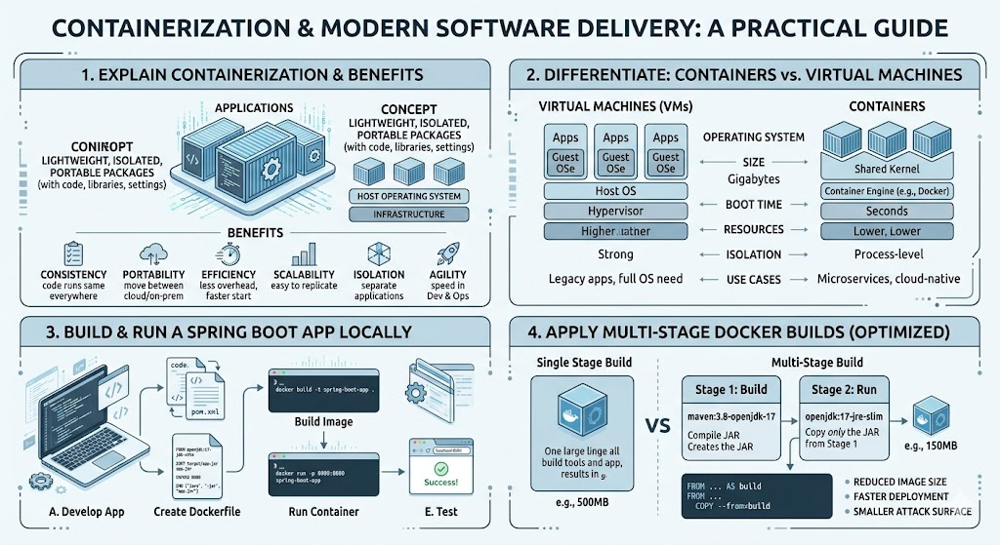

# [4.4] Cloud Native Application - Local Containerization

## Lesson Overview

## Dependencies
- [Self Studies](./studies.md)
- [Lesson](./lesson.md)
- [Assignment](./assignment.md)

## Lesson Objectives
* **Explain** the concept of containerization and its benefits in modern software delivery
* **Differentiate** between containers and virtual machines in terms of architecture and use cases
* **Build and run** a Docker image for a Spring Boot application on a local machine
* **Apply** multi-stage Docker builds to create optimized production-ready images

## Lesson Plan

| Duration | What | How or Why |
|----------|------|------------|
| 10 min | Warm up | Intro and lesson overview, check prerequisites |
| 30 min | Part 1: What is Containerization | Containers, VMs comparison, benefits, and use cases |
| 10 min | Activity 1 — Containers in the real world | Group discussion on how containerization solves real-world problems |
| 20 min | Part 2: Docker and Dockerfile | What is Docker, when to use it, writing Dockerfiles, Dockerfile instructions |
| 15 min | Verify project and create Dockerfile | Learners create Dockerfile and .dockerignore in their devops-demo project |
| 30 min | Part 3: Build and run Docker containers | Docker images vs containers, CLI commands, hands-on build and run |
| 10 min | Activity 2 — Stop and remove container | Learners practice stopping, removing containers and images via CLI |
| 30 min | Part 4: Multi-stage builds | Multi-stage Dockerfile, naming stages, benefits, running multi-stage builds, Docker logs |
| 10 min | Recap and wrap up | Summary, key takeaways, troubleshooting guide review, Q&A |
| **Total** | | **165 min — allows ~15 min buffer** |